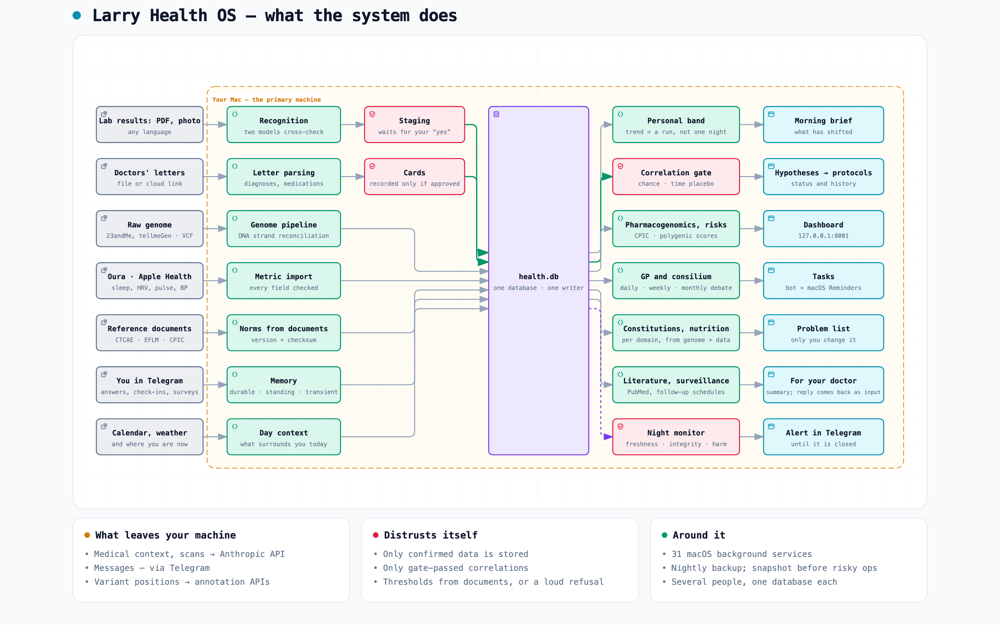

# Larry Health OS

**English** · [Русский](README.ru.md)

**A health system that comes to you: it remembers when your labs are due, notices shifts, brings
you hypotheses and correlations it has found — and stays quiet when there is nothing to say.**

Your doctor said: "ferritin — recheck in three months." Three months later, only you remember —
if you do. Your ring draws a sleep chart every morning, but to tell whether things are worse than
six months ago you have to open the app, scroll and compare. Your lab results sit in PDFs from
different labs, each with its own names and reference ranges. Health apps wait for you to come to
them. This system works the other way round: it remembers for you, compares for you, and comes to
you on its own — when there is something to say.

> **Status.** An experimental system the author builds for himself and the people close to him.
> Not a medical device; it does not diagnose or prescribe. Medical decisions stay with a human
> doctor: the system prepares the questions and a summary, and you take them to your doctor.
>
> **Language.** Onboarding and most of the bot's buttons and fixed replies are in English; a few
> cards (such as confirming a problem-list entry) are not yet. The morning brief, the consilium and
> everything else the language model writes are **still in Russian** — for an
> English speaker that is most of the value today. Most documentation has an English version.

<picture>
  <source media="(prefers-color-scheme: dark)" srcset="docs/assets/architecture.en.dark.png">
  
</picture>

<sub>Seven streams — lab results, doctors' letters, Oura, Apple Health, genome, day context
(calendar, weather, air), questionnaires — go into one local database; out of it come the morning
brief, tasks and alerts. Interactive diagram with guided views and zoom — [`docs/assets/architecture.en.html`](docs/assets/architecture.en.html).</sub>

---

## What problem it solves

Medicine is built around the episode: you come with a complaint, you get examined, diagnosed,
treated. Everything between visits is left to you: remembering deadlines, noticing changes,
connecting one thing with another. This applies to anyone who sees doctors year after year, but
it is sharpest after a serious illness: the doctors saved you and let you go, and nobody can really
tell you how to get your old quality of life back — recovery protocols are still scarce. From here
on, you're on your own.

And "on your own" means a heap of scattered pieces. A ring and a watch measure your sleep and pulse
every day, years of lab results sit in PDFs, doctors' letters say what was prescribed and when to
recheck. But none of these streams answers the simple question: what here matters for me, right
now? Norms "for people in general" help little: everyone has their own normal, and after heavy
treatment all the more so. What the textbook calls "low" may be your ordinary level, while a real
shift hides inside the "normal" range.

This system keeps the thread between visits. It gathers everything in one place, compares it with
your own normal, remembers the deadlines, notices what adds up from many small things, and turns
it into a hypothesis that can be checked. For example: ferritin "normal" in three tests in a row,
but lower each time, while your resting pulse crept up over the same months; apart — nothing,
together — a question for your doctor: "could I be slowly losing iron?" The system does not make
medical decisions: you take the hypothesis to a human doctor and forward the answer to the
Telegram bot — in your own words or as the doctor's letter — and it comes back into the system as
new data. So you come to your doctor with a picture rather than a feeling, and between visits that
picture is kept by the system, not by your memory.

## It comes to you

You don't open it — it writes to you in Telegram. A typical week looks like this:

- **Every morning — a brief.** "Deep sleep has been below your usual range for the fourth night;
  last week it wasn't." What has shifted, plus a few practical suggestions for the day (food,
  load); what hasn't changed isn't repeated.
- **When something is due.** "Time to recheck ferritin: the last test was seven months ago, and
  your doctor's letter asked for six." → a task in the bot and in macOS Reminders.
- **When it needs your word.** "You saw the cardiologist on the 12th. What did they say about the
  dose?" — you reply to that message, and your answer is saved: it goes into the summary the
  system prepares for your next doctor's visit.
- **Once a week — a report and correlations.** The AI specialists' weekly review, and with it new
  correlations: "A new correlation passed the check: in weeks with late workouts, your resting
  pulse is higher." Only correlations that passed a statistical check
  against coincidence are sent.
- **Once a month — hypotheses.** A consilium — a panel of AI "doctors" of different specialties —
  proposes hypotheses; you confirm or reject them (or take one to your doctor and bring back the
  answer). A confirmed one becomes a protocol: a concrete
  plan (what to do, what to measure, when to check) that waits for the next data.
- **Weekly — new papers.** New PubMed papers on your conditions; if one changes a
  recommendation, you get a proposed edit to your problem list (the list of your diagnoses and
  conditions), approved with one tap.
- **When data is missing.** Missing ring data does not by itself stop the brief. The generator
  is instructed to acknowledge missing sleep data without inventing numbers and, after a
  configured run of missing nights, to suggest checking the ring. If the integrity monitor
  reports critical findings, a warning header is sent before the brief.

You don't need to remember when you last had a test, what the doctor asked for, or which numbers
to compare. It remembers.

## Why it doesn't nag

A system that pings you about every little thing ends up muted within a week — along with the one
signal that mattered. So its proactivity comes with brakes:

- **A trend, not a spike.** One bad night is just a bad night; an alert is a run of days. In the
  first week there are no multi-day trends at all: nothing to build them from. The exception is
  danger: a value past a clinical danger threshold doesn't need a run of days — it goes out as its
  own urgent message with the next morning's brief, ahead of it, not buried inside. It is not an
  emergency service: hours can pass between the value arriving and that message.
- **Chronic things — once a month.** A long-known gene variant or deficiency doesn't show up every
  morning as news.
- **One finding — one message.** Each finding (about your health or about a broken data source)
  gets one card in the bot with a status; seeing it again the next day doesn't produce a new message.
- **No guesses from a model's memory.** A correlation reaches you only if it passed the statistical
  check; the line for "dangerous" comes from a published clinical document, never from a model's
  memory. Otherwise — silence or an explicit "I can't tell", never a guess. (For lab results, whether a
  change is real comes from a document too; for daily wearable data — sleep, heart rate — how many
  days make a run and how far below your usual level counts, are tuned by hand: see
  [What it doesn't do](#what-it-doesnt-do).)
- **Questions with a return address.** Things to *do* (recheck a test) go to Reminders; things to
  *answer* are asked as a bot message you can reply to — a reminder that gets ticked off would
  lose your answer.
- **Silence has a reason.** If the brief leaves something out, the reason is written to the
  database — silence is a decision, not an accident. You don't see these reasons in the bot; they
  are there so the system's behaviour can be checked afterwards.

## You don't have to learn it

The interface is Telegram and answering questions. You start with what you have: the bot and a
few lab PDFs are enough; an Oura ring, Apple Health and a genome each add their part when
connected. Onboarding is a short set of questions, about
ten minutes; after that you send files (labs, doctors' letters, raw genome) and answer when asked. There
are 33 commands (`/labs`, `/sleep`, `/consult` …) and a local dashboard — but they are a window for
the curious, not a place you have to visit.

---

## Under the hood

**Collecting into one database.**
- **Lab results from PDFs and photos** (`lab_recognizer`): a model reading a scan directly drops
  the decimal point — 15.2 becomes 152. So two models read each page and cross-check, separate
  checks catch the physiologically impossible, and the result waits for your "yes". Test names are
  mapped to LOINC, the international catalogue of lab tests: one test with three names in three
  labs is one test in the database.
- **Doctors' letters** (`doc_intake`): diagnoses and medications arrive as cards; only what you
  confirm enters your record. From the doctor's plan the system takes the follow-up schedule —
  that is where the "time to recheck" reminders come from.
- **Oura and Apple Health**: sleep, heart rate variability (HRV), pulse, activity, weight and body
  composition, blood pressure. Apple Health data comes from your phone through Health Auto
  Export — an ordinary third-party app from the App Store, nothing to build yourself — straight to
  your Mac over your own private network. The app is free, but automatic sending to your Mac is
  a Premium feature (on the App Store as of September 2026: from $1.99 a month or $24.99 lifetime).
- **Genome** (`genome_pipeline`): raw data from 23andMe, AncestryDNA, MyHeritage, FTDNA,
  tellmeGen, LivingDNA, and a whole genome in VCF. DNA has two strands, and the same variant can be
  written as A on one and T on the other; your file and the clinical databases often use different
  strands. The system reconciles them and, where it can't be sure, says "unknown" instead of
  guessing.
- **Day context**: calendar, weather and air quality where you are; questionnaires on a schedule.

**Your normal, not the textbook's.**
- **Your usual range**: every metric is compared with your own usual level over the past year —
  or, if you mark a date when an illness started, with your level before it. A lab result also
  "expires": a stable value stays valid longer, a value that has shifted needs a recheck sooner.
- **Thresholds come from documents, not from a model's memory** (`norm_documents`). What counts
  as a dangerous value comes from NCI CTCAE — the standard scale doctors use to grade how far a
  lab value is off, published by the US National Cancer Institute but used well beyond cancer
  care. Whether a change is a real shift or normal day-to-day wobble comes from the biological
  variation database of EFLM, the European federation of laboratory medicine. Each document is
  stored with its version, so a number can always be traced to its source.
- **Pharmacogenomics and risks**: how your genes affect the way you process medicines (by the
  guidelines of CPIC, the international consortium that turns gene results into prescribing
  advice), and polygenic risk scores — risk estimates that add up the small
  effects of many gene variants — by health domain.

**Conclusions — and doubts about them.**
- **A general practitioner and a consilium**: an AI "general practitioner" (GP) reviews your data
  daily, AI specialists weekly, and once a month there is a consilium: up to 16 medical roles and 4 lifestyle coaches. The specialist prompts come
  from the open-source project [WellAlly-health](https://github.com/huifer/WellAlly-health) (MIT);
  the design of the consilium is our own. It is built as a debate: in round one each answers blind,
  in round two each sees the others and may disagree — so that models don't simply echo the first
  confident voice.
- **A gate against false correlations** (`correlation_gate`): on one person's data, "coffee →
  sleep" can be a coincidence of periods — you drank coffee on holiday and slept well because of the
  holiday. Every correlation is tested against chance; against having tried hundreds of pairs at
  once (some will look strong by luck); and against a "placebo in time" — the same test with the
  dates shifted, which should find nothing if the link is real.
- **Hypotheses → protocols**: a hypothesis lives as a record with a status and a history; a
  confirmed one becomes a protocol, a refuted one is closed with a reason.
- **Health constitutions**: a personal rulebook per domain — sleep, nutrition, stress, movement.
  Not "the norm is 8,000 steps" but "your load threshold without recovery is N, and here is why".
- **Nutrition**: food suggestions in the brief follow a frame built from your conditions — what to
  limit, minimums it never goes below — plus seasonal produce of your region and your tastes.

**Memory and the medical record.**
- **Memory with a time axis**: facts from conversations are durable (genetics), standing until
  changed (treatment status), or transient (one bad night stops being shown to the model once
  it expires) — so old news is never presented as current.
- **Doctor in the loop**: the doctor does not use the system. You bring their answer back — a
  letter or a few words to the bot — and it becomes input: confirmed, and the hypothesis becomes a
  protocol; corrected, and it goes to another consilium round.
- **Only you change the problem list**: models propose edits one at a time, with a plain-language
  explanation.

**Watching itself.**
- **Morning integrity check**: about 200 checks of its own state — freshness of every source,
  database integrity, whether yesterday's jobs actually ran.
- **Night review of findings**: operational faults of its own (a stuck service, a job that
  didn't run) it fixes itself; your data and medical record it never changes on its own — what is
  yours to decide arrives as a question.
- **An "is the system itself doing harm" sensor**: a stream of identical messages, or your "what is
  this?" in reply to the bot, counts as a failure even when every technical sensor is green.
- **Backup** every night and a snapshot before any risky operation. The code itself is covered by
  about 5,900 automated software tests.

---

## How it runs

A typical day: backup at night; the integrity check at 07:50; the brief in Telegram in the
morning; ring and phone data every few hours; specialists, correlations and a literature search on
Sundays; the consilium on the first of the month. All of this runs in Docker: four permanent
services (the bot, the file processor, the dashboard and the scheduler) and about twenty-five
scheduled jobs.

One machine is primary: it has to stay on, and only it writes the database and runs the services. One installation can
serve several people, for example a family: each has their own database, secrets, bot and
background services, and picks their own language at onboarding (today it switches the bot's
own texts; the model's texts follow later)
([how to add a person](docs/how-to/add_person.en.md)). Refusal to choose a default person is
opt-in: only with a nonempty `HEALTH_MULTITENANT` does data-directory resolution fail when
`HEALTH_DATA_DIR` is missing. Without that flag, the primary machine defaults to the main
installation's data directory. For a multi-person installation, set `HEALTH_MULTITENANT=1`
for manual commands and background services, and give each process its person's paths;
the linked guide explains how. The tenant installer does not enable this guard for you.

---

## What leaves your machine

The database, the genome file and your documents are stored only on your machine (a file you
share through a cloud link stays on that drive until you delete it there). But their
content is sent in requests as listed below — worth knowing up front:

| Where | What | Why |
|---|---|---|
| Anthropic API | your medical context in the request text: profile, metrics, labs, document excerpts, scanned lab pages | briefs, consilium, reading labs |
| Telegram | bot messages and the files you send | interface |
| Oura API | a request for your data with your token | import |
| PubMed (NCBI) | search queries with condition names, no name of yours | literature search |
| myvariant.info, EBI, NCBI, PGS Catalog | identifiers and positions of your variants (rsID), no name of yours | genome annotation, polygenic risks |
| Google Calendar | reading events, if connected | day context |
| Open-Meteo, WAQI, OpenStreetMap Nominatim, BigDataCloud | your approximate coordinates | weather, air quality and the place name for the day context |
| NCI, EFLM | only document downloads at install time | thresholds and variation |
| GitHub | a check for new versions of the WellAlly prompts | prompt updates |
| A cloud drive of your choice | only the files you choose to share by link (e.g. a whole genome) | Telegram can't carry files over 20 MB |
| healthchecks.io (optional) | a daily "still alive" ping, no data | an alert if the Mac goes silent |

Secrets (tokens, keys) are checked before every model call: if a secret ends up in the request
text, the call is blocked. This filter does not strip medical data — without it there is no brief.
The dashboard has no password, so it listens only on the machine itself (`127.0.0.1`); each
person's bot answers only that person's Telegram account. Model calls go through your own Anthropic API key and are
billed to it — for one person, about €5–15 a month in the author's experience; how Anthropic stores API data is set by its own commercial terms and privacy policy
— worth reading before you connect a relative's records.

---

## Installation

Docker (any: Docker Desktop, OrbStack or Colima on a Mac; Docker Engine on Linux; Windows via WSL2, not yet verified), a Telegram account, an Anthropic API
key (about €5–15 a month per person). About 20 minutes:
[docs/tutorials/first_install.en.md](docs/tutorials/first_install.en.md) — from downloading two
files to meeting the bot. The image is prebuilt for amd64 and arm64; nothing to clone or build.
Your own build (other document recognition languages, your own code changes):
[docs/how-to/install_docker.en.md](docs/how-to/install_docker.en.md).

## What it doesn't do

- It does not diagnose or replace a doctor: medical decisions belong to a human.
- It does not integrate with clinics' medical record systems: you bring the documents yourself.
- It is not a one-click install. Windows works only through WSL2, and that path is not verified yet.
- It has no outside watchdog by default: if the primary Mac is off or asleep, nothing runs. The
  only outside signal is an optional daily check-in to a dead-man's-switch service
  (healthchecks.io): if the check-in stops, that service emails you.
- It does not read raw sequencing reads (FASTQ). A whole genome in VCF (`.vcf` or `.vcf.gz`) is
  accepted through the bot as a cloud link, since Telegram caps files at 20 MB; parsing takes hours.
  A VCF lists only where you differ from the reference genome, so a missing position usually means
  "same as reference". The system assumes that only for a whole genome from a known variant caller,
  and then with reduced confidence; for CYP2D6 and HLA-B, genes where that assumption is unsafe,
  never.
- **When to step in on daily data is decided by hand-picked thresholds** tuned on two people's
  data: how far below your usual level sleep or heart rate has to fall to worry, how many days in a
  row make a run. They have not been validated against
  real outcomes — this is an engineering judgement, not a proven optimum. For the first weeks the
  system will stay quiet more than it speaks: there isn't enough data yet.

---

## For people who work on the code

Half of the project is protection against its own mistakes: a registry of subsystem intent with
checkable claims (`subsystem_intent.yaml`), searching existing code by the data it touches before
building anything new (`project_context`), a commit gate that requires a new module to have
written-down boundaries, and a public-zone guard that keeps personal data out of the open code.

| What | Where |
|---|---|
| Installation tutorial | [`docs/tutorials/`](docs/tutorials/) |
| How to do a specific task | [`docs/how-to/` — start here](docs/how-to/README.en.md) |
| Why it works this way | [`docs/explanation/`](docs/explanation/) |
| Modules, DB schema, paths, schedule | [`ARCH_SNAPSHOT.md`](ARCH_SNAPSHOT.md), [`docs/reference/`](docs/reference/) |
| Security | [`SECURITY.md`](SECURITY.md) |
| Test contracts and oracles | [`TESTING_CONTRACTS.md`](TESTING_CONTRACTS.md) |

Documents are written in Russian; most have an English version next to them (`<name>.en.md`).

```
bot/, handlers/     — Telegram bot: commands, onboarding, report delivery
jobs/               — scheduled jobs
dashboard_*/        — local web dashboard
methodology/        — rule sets: questionnaires, conditions, nutrition, the validation gate
specialists/        — agent prompts
data/               — source documents for norms (snapshots)
scripts/            — installation, clean-clone probe, utility scripts
templates/          — installation templates (config, rule sets, launchd plists)
tests/              — tests (pytest)
docs/               — documentation, organised by Diátaxis
```

## Standing on the shoulders of

- **[WellAlly-health](https://github.com/huifer/WellAlly-health)** (MIT) — the specialist doctor
  prompts. The system tracks upstream updates on its own (`check_wellally_updates.py`) and applies
  them only by hand: a doctor's prompt changes medical conclusions.
- **Reference data**: NCI CTCAE, the EFLM biological variation database, CPIC, LOINC, ClinVar,
  PGS Catalog, PubMed.

License — Apache-2.0 (`LICENSE`); third-party code, prompts and data terms — `NOTICE.md`.
