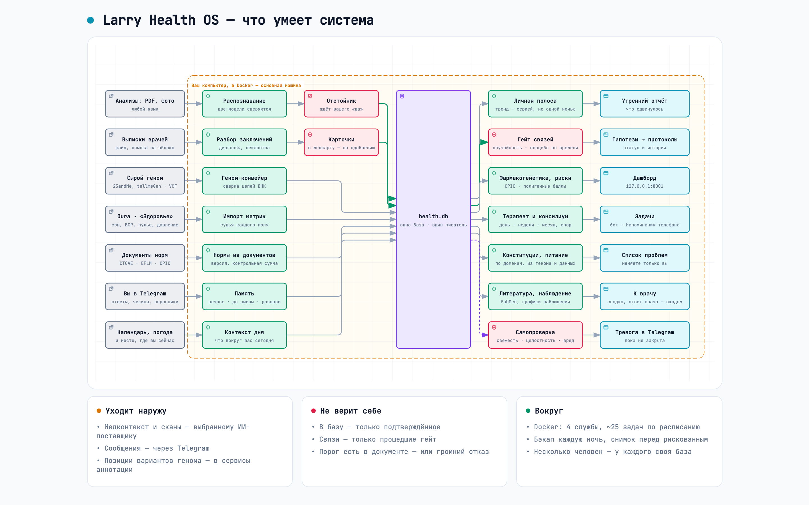

# Larry Health OS

[English](README.md) · **Русский**

**Система здоровья, которая приходит к вам сама: помнит сроки анализов, замечает сдвиги,
приносит гипотезы и найденные связи — и молчит, когда сказать нечего.**

Врач сказал: «ферритин — повторить через три месяца». Через три месяца об этом помните только
вы — если помните. Кольцо каждое утро рисует график сна, но чтобы понять, стало ли хуже, чем
полгода назад, надо открыть приложение, листать и сравнивать. Анализы лежат в PDF от разных
лабораторий, у каждой свои названия и референсы. Приложения о здоровье ждут, пока вы к ним
придёте. Эта система устроена наоборот: она помнит за вас, сравнивает за вас и приходит сама —
когда есть о чём сказать.

> **Статус.** Экспериментальная система, которую автор строит для себя и близких людей.
> Не медицинское изделие, не ставит диагнозов и не назначает лечения. Медицинские решения
> остаются за живым врачом: система готовит вопросы и сводку, а к врачу их несёте вы.
>
> **Язык.** Знакомство и большая часть кнопок и готовых ответов бота есть по-русски и
> по-английски. Только по-русски пока несколько карточек (например, подтверждение записи в списке
> проблем), а также утренний отчёт, консилиум и всё, что пишет языковая модель. Документация —
> на русском, у большей части есть английская версия.

<picture>
  <source media="(prefers-color-scheme: dark)" srcset="docs/assets/architecture.ru.dark.png">
  
</picture>

<sub>Семь потоков — анализы, выписки врачей, Oura, «Здоровье» iPhone, геном, контекст дня
(календарь, погода, воздух), опросники — сходятся в одну базу на вашей машине; из неё выходят
утренний отчёт, задачи и тревоги. Интерактивная схема с маршрутами и масштабом —
[`docs/assets/architecture.ru.html`](docs/assets/architecture.ru.html).</sub>

---

## Какую задачу она решает

Медицина хорошо устроена вокруг эпизода: пришли с жалобой — вас обследовали, поставили диагноз,
вылечили. Всё, что между визитами, остаётся на вас: помнить сроки, замечать перемены, связывать
одно с другим. Это касается любого, кто годами наблюдается у врачей, но острее всего видно после
тяжёлой болезни: врачи спасли и отпустили, а как вернуть себе прежнее качество жизни, толком не
расскажет никто — протоколов восстановления пока мало. Дальше — сам.

А «сам» — это ворох разрозненного. Кольцо и часы каждый день меряют сон и пульс, анализы за
несколько лет лежат в PDF, в выписках записано, что назначил врач и когда перепроверить. Но ни один
из этих потоков не отвечает на простой вопрос: что из этого важно именно для меня и именно сейчас?
Нормы «для людей вообще» тут плохо помогают: у каждого своя норма, а после тяжёлого лечения —
особенно. То, что по учебнику «низко», для вас может быть обычным уровнем, а настоящий сдвиг
прячется внутри «нормы».

Эта система держит непрерывность между визитами. Она собирает всё в одно место, сравнивает с
вашей собственной нормой, помнит сроки, замечает то, что складывается из многих мелочей, и
превращает это в проверяемую гипотезу. Например: ферритин в трёх анализах подряд «в норме», но
каждый раз ниже прежнего, а пульс в покое за те же месяцы подрос; по отдельности — ничего,
вместе — вопрос врачу: «нет ли медленной потери железа?». Медицинское система не решает:
гипотезу вы несёте живому врачу, а его ответ пересылаете в Telegram-бот — словами или письмом
врача, — и он возвращается в систему новыми данными. В итоге к врачу вы приходите не с
ощущениями, а с картиной, а между визитами эту картину держит система, а не ваша память.

## Она приходит сама

Вы её не открываете — она пишет вам в Telegram. Так выглядит обычная неделя:

- **Каждое утро — отчёт.** «Глубокий сон четвёртую ночь ниже вашего обычного уровня; на прошлой
  неделе такого не было.» То, что сдвинулось, и несколько практических советов на день (еда,
  нагрузка); неизменившееся не повторяется.
- **Когда подходит срок.** «Пора пересдать ферритин: прошлый анализ — семь месяцев назад, врач
  в заключении просил через шесть.» → задача в боте и в Напоминаниях macOS.
- **Когда нужно ваше слово.** «Вы были у кардиолога 12-го. Что он сказал про дозу?» — вы
  отвечаете на это сообщение, и ответ сохраняется: он попадёт в сводку, которую система
  готовит к следующему визиту к врачу.
- **Раз в неделю — отчёт и связи.** Еженедельный разбор ИИ-специалистов, а с ним новые связи:
  «Новая связь прошла проверку: в недели с поздними тренировками пульс покоя выше.» Приходят
  только связи, прошедшие статистическую проверку на совпадение.
- **Раз в месяц — гипотезы.** Консилиум — несколько ИИ-«врачей» разных специальностей —
  предлагает гипотезы; вы подтверждаете или отклоняете их (или несёте гипотезу своему врачу и
  возвращаете его ответ). Подтверждённая становится протоколом: конкретным планом (что делать,
  что измерять, когда проверить), который ждёт следующих данных.
- **Раз в неделю — новые статьи.** Новые работы PubMed по вашим состояниям; если работа меняет
  рекомендацию — предложение правки в список проблем (список ваших диагнозов и состояний),
  одобрение одним нажатием.
- **Когда данных нет.** Отсутствие данных кольца само по себе не останавливает отчёт.
  Генератор получает инструкцию обозначить отсутствие данных сна, не выдумывать числа и
  после заданной серии пропущенных ночей предложить проверить кольцо. Если монитор
  целостности сообщил о критических находках, перед отчётом отправляется предупреждение.

Вам не нужно помнить, когда сдавали анализ, что просил врач и какие показатели сравнивать.
Помнит она.

## Почему она не надоедает

Система, которая дёргает по каждому шороху, через неделю уходит в беззвучный режим — вместе с
тем единственным сигналом, который был важен. Поэтому у проактивности здесь тормоза:

- **Тренд, а не всплеск.** Одна плохая ночь — просто плохая ночь; тревога — это серия дней
  подряд. Первую неделю многодневных трендов нет вовсе: не из чего. Исключение — опасность:
  значению за клиническим порогом опасности серия не нужна: оно уходит отдельным срочным
  сообщением вместе с ближайшим утренним отчётом, перед ним, а не теряется внутри. Это не скорая
  помощь: между приходом значения и этим сообщением могут пройти часы.
- **Хроника — раз в месяц.** Давняя особенность гена или известный дефицит не звучат каждое
  утро как новость.
- **Одна находка — одно сообщение.** У каждой находки (о здоровье или о сломанном источнике
  данных) одна карточка в боте со статусом; если назавтра она видна снова, нового сообщения
  нет.
- **Никаких догадок из памяти модели.** Связь приходит к вам, только если прошла статистическую проверку;
  граница «опасно» берётся из опубликованного клинического документа, никогда из памяти модели.
  Иначе — молчание или прямое «не могу сказать», но не догадка. (Для анализов и «настоящий ли
  сдвиг» решает документ; для ежедневных данных с носимых устройств — сна, пульса — сколько дней
  образуют серию и насколько ниже обычного тревожно, подобрано руками: см.
  [Чего она не делает](#чего-она-не-делает).)
- **Вопрос с обратным адресом.** То, что нужно *сделать* (пересдать анализ), уходит в
  Напоминания; то, на что нужно *ответить*, приходит сообщением в боте, на которое можно
  ответить: напоминание, закрытое галочкой, потеряло бы ответ.
- **У молчания есть причина.** Если отчёт о чём-то умолчал, причина записывается в базу: молчание —
  решение, а не случайность. В боте эти причины не показываются — они нужны, чтобы потом
  проверить, правильно ли система промолчала.

## Вам не нужно в ней разбираться

Интерфейс — это Telegram и ответы на вопросы. Начинать можно с того, что есть: хватит бота и
нескольких PDF с анализами; кольцо Oura, «Здоровье» iPhone и геном добавят своё, когда вы их
подключите. Знакомство — несколько коротких вопросов, минут на десять; потом вы присылаете файлы
(анализы, выписки, сырой геном) и отвечаете, когда спрашивают. 33 команды (`/labs`, `/sleep`,
`/consult` …) и локальный дашборд существуют — но это окно для любопытных, а не место, куда
нужно ходить.

---

## Что у неё под капотом

**Сбор в одну базу.**
- **Анализы из PDF и фото** (`lab_recognizer`): модель, читающая скан напрямую, роняет
  десятичную точку — 15.2 становится 152. Поэтому страницу читают две модели и сверяются,
  отдельные проверки ловят физиологически невозможное, результат ждёт вашего «да». Имя анализа
  приводится к LOINC — международному каталогу лабораторных тестов: у одного теста три названия
  в трёх лабораториях, в базе он один.
- **Выписки врачей** (`doc_intake`): диагнозы и лекарства приходят карточками, в медкарту —
  только подтверждённое. Из плана врача система берёт график наблюдения — отсюда напоминания о
  сроках.
- **Oura и «Здоровье» iPhone**: сон, вариабельность сердечного ритма (ВСР), пульс, активность,
  вес и состав тела, давление. Данные «Здоровья» идут с телефона через Health Auto Export —
  обычное стороннее приложение из App Store, ничего собирать самому не нужно — прямо на ваш Mac
  по вашей частной сети. Приложение бесплатное, но автоматическая отправка данных на Mac есть
  только в Premium (в App Store на сентябрь 2026 — от $1.99 в месяц или $24.99 навсегда).
- **Геном** (`genome_pipeline`): сырые данные 23andMe, AncestryDNA, MyHeritage, FTDNA, tellmeGen,
  LivingDNA и полный геном в VCF. У ДНК две цепи, и один и тот же вариант на одной записан как
  A, на другой — как T; ваш файл и клинические базы часто пользуются разными цепями. Система
  сверяет их, а где уверенности нет, пишет «неизвестно», а не угадывает.
- **Контекст дня**: календарь, погода и воздух там, где вы сейчас; опросники по расписанию.

**Ваша норма, а не учебная.**
- **Ваш обычный уровень**: каждый показатель сравнивается с вашим собственным уровнем за год —
  или, если отметить дату начала болезни, с уровнем до неё. У результата анализа есть срок
  годности: стабильное значение действует дольше, сдвинувшееся надо пересдать раньше.
- **Пороги — из документов, а не из памяти модели** (`norm_documents`). Что считать опасным
  значением, берётся из NCI CTCAE — стандартной шкалы, которой врачи оценивают, насколько
  анализ отклонился; её издаёт Национальный институт рака США, но пользуются ею далеко за
  пределами онкологии. Настоящий ли это сдвиг или обычное колебание день ото дня — из базы
  биологической вариации EFLM, Европейской федерации лабораторной медицины. Каждый документ
  хранится с версией, поэтому любое число можно проследить до источника.
- **Фармакогенетика и риски**: как ваши гены влияют на то, как вы перерабатываете лекарства (по
  рекомендациям CPIC — международного консорциума, который переводит генетические результаты в
  советы по назначению), и полигенные риски — оценки, складывающие малые вклады многих вариантов
  генов, — по областям здоровья.

**Выводы — и сомнения в них.**
- **Терапевт и консилиум**: ИИ-«терапевт» разбирает ваши данные каждый день, ИИ-специалисты —
  раз в неделю, а раз в месяц собирается консилиум: до 16 врачебных ролей и 4 коуча образа
  жизни. Промпты врачей-специалистов взяты из открытого проекта
  [WellAlly-health](https://github.com/huifer/WellAlly-health) (MIT); устройство консилиума —
  своё. Он устроен как спор: в первом раунде каждый отвечает вслепую, во втором видит остальных
  и может не согласиться — чтобы модели не повторяли за первым уверенным голосом.
- **Гейт против ложных связей** (`correlation_gate`): на данных одного человека «кофе → сон»
  может оказаться совпадением периодов — вы пили кофе в отпуске и спали хорошо из-за отпуска.
  Каждая связь проверяется на случайность; на то, что перебраны сотни пар сразу (какие-то
  покажутся сильными по везению); и на «плацебо во времени» — тот же тест со сдвинутыми датами,
  который ничего не должен найти, если связь настоящая.
- **Гипотезы → протоколы**: гипотеза живёт записью со статусом и историей; подтверждённая
  становится протоколом, опровергнутая закрывается с причиной.
- **Конституции здоровья**: личный свод правил по каждой области — сон, питание, стресс,
  движение. Не «норма 8000 шагов», а «ваш порог нагрузки без восстановления — N, и вот почему».
- **Питание**: советы по еде в отчёте идут в рамке, построенной по вашим состояниям — что
  ограничить, ниже каких минимумов не опускаться, — плюс сезонные продукты региона и ваши вкусы.

**Память и медкарта.**
- **Память с осью времени**: факты из разговоров — вечные (генетика), действующие до смены
  (статус лечения) или разовые (одна плохая ночь перестаёт показываться модели, когда истёк её
  срок) — чтобы старое не подавалось как текущее.
- **Врач в петле**: сам врач системой не пользуется. Вы приносите его ответ — выписку или
  несколько слов боту, — и он становится входом: подтвердил, и гипотеза становится протоколом;
  поправил — идёт на новый круг консилиума.
- **Список проблем меняете только вы**: модели предлагают правки по одной, с объяснением
  простыми словами.

**Самоконтроль.**
- **Утренняя проверка**: около 200 проверок собственного состояния — свежесть каждого
  источника, целостность базы, выполнились ли вчерашние задания.
- **Ночной разбор находок**: свои технические сбои (зависшая служба, невыполненное задание)
  система чинит сама; ваши данные и медкарту сама не меняет никогда — что решаете вы, приходит
  вопросом.
- **Датчик «не вредит ли система сама»**: поток одинаковых сообщений или ваш вопрос «что это?» на
  сообщение бота — поломка, даже когда все технические датчики зелёные.
- **Бэкап** каждую ночь и снимок перед рискованной операцией. Сам код покрыт примерно 5 900
  автоматическими тестами.

---

## Как это работает

Типичный день: ночью — бэкап; в 07:50 — проверка целостности; утром — отчёт в Telegram; днём —
данные с кольца и телефона каждые несколько часов; по воскресеньям — специалисты, связи и
поиск литературы; первого числа — консилиум. Всё это работает в Докере: четыре постоянные службы
(бот, разборщик файлов, дашборд и планировщик) и около двадцати пяти задач по расписанию.

Одна машина — основная: она должна быть всегда включена, и только он пишет базу и держит службы.
Одна установка может вести нескольких людей, например семью: у каждого своя база, свои
секреты, свой бот и свои фоновые службы, а язык каждый выбирает при знакомстве (сегодня это
переключает тексты самого бота; тексты модели — позже)
([как добавить человека](docs/how-to/add_person.md)). Отказ выбирать человека по умолчанию
включается отдельно: только при непустом `HEALTH_MULTITENANT` определение каталога данных
завершается ошибкой, если не задан `HEALTH_DATA_DIR`. Без этого флага основная машина берёт
каталог данных основной установки. Для нескольких людей задайте `HEALTH_MULTITENANT=1`
для ручных команд и фоновых служб, а каждому процессу — пути его человека; порядок описан
в инструкции по ссылке. Установщик с `--tenant` сам этот предохранитель не включает.

---

## Что уходит с вашей машины

База, файл генома и ваши документы хранятся только на вашей машине (файл, присланный ссылкой
из облака, остаётся на том диске, пока вы его там не удалите). Но их содержимое уходит в
запросах, перечисленных ниже, — это стоит знать заранее:

| Куда | Что | Зачем |
|---|---|---|
| Anthropic API | ваш медицинский контекст в тексте запроса: профиль, показатели, анализы, фрагменты документов, сканы страниц анализов | отчёты, консилиум, чтение анализов |
| Telegram | сообщения бота и присланные вами файлы | интерфейс |
| Oura API | запрос ваших данных вашим токеном | импорт |
| PubMed (NCBI) | поисковые запросы с названиями состояний, без имени | поиск литературы |
| myvariant.info, EBI, NCBI, PGS Catalog | идентификаторы и позиции ваших вариантов (rsID), без имени | аннотация генома, полигенные риски |
| Google Calendar | чтение событий, если подключили | контекст дня |
| Open-Meteo, WAQI, OpenStreetMap Nominatim, BigDataCloud | ваши примерные координаты | погода, качество воздуха и название места для контекста дня |
| NCI, EFLM | только скачивание документов при установке | пороги и вариация |
| GitHub | проверка новых версий промптов WellAlly | обновление промптов |
| облачный диск по вашему выбору | только файлы, которыми вы делитесь ссылкой (например, полный геном) | Telegram не пропускает файлы больше 20 МБ |
| healthchecks.io (необязательно) | ежедневный сигнал «жив», без данных | тревога, если Mac замолчал |

Секреты (токены, ключи) проверяются перед каждым вызовом модели: если в тексте запроса оказался
секрет, вызов блокируется. Медицинские данные этот фильтр не вырезает — без них отчёт
невозможен. Дашборд без пароля, поэтому слушает только саму машину (`127.0.0.1`); бот каждого
человека отвечает только его аккаунту Telegram. Вызовы модели идут через ваш собственный ключ
Anthropic API и оплачиваются им — на одного человека по опыту автора около 5–15 € в месяц; как Anthropic хранит данные API, определяют его условия
обслуживания и политика конфиденциальности — их стоит прочитать, прежде чем подключать данные
родственника.

---

## Установка

Докер (любой: на Маке — Docker Desktop, OrbStack или Colima; на Linux — Docker Engine; Windows — через WSL2, этот путь пока не проверен), аккаунт Telegram, ключ Anthropic
API (около 5–15 € в месяц на человека). Около 20 минут:
[docs/tutorials/first_install.md](docs/tutorials/first_install.md) — от скачивания двух файлов до
знакомства с ботом. Образ собран заранее для amd64 и arm64; клонировать и собирать ничего не нужно.
Своя сборка (другие языки распознавания документов, свои правки кода):
[docs/how-to/install_docker.md](docs/how-to/install_docker.md).

## Чего она не делает

- Не ставит диагноз и не заменяет врача: медицинское решает человек.
- Не интегрируется с медицинскими информационными системами клиник: документы вы приносите сами.
- Не устанавливается одной кнопкой. Windows — только через WSL2, и этот путь пока не проверен.
- Без внешнего сторожа по умолчанию: если основной Mac выключен или спит, не работает ничего.
  Единственный внешний сигнал — необязательная ежедневная отметка в службе «кнопки мертвеца»
  (healthchecks.io): если отметки прекратились, эта служба пришлёт вам письмо.
- Не читает сырые прочтения секвенирования (FASTQ). Полный геном в VCF (`.vcf` или `.vcf.gz`)
  бот принимает ссылкой на облако — Telegram не пропускает файлы больше 20 МБ; разбор идёт
  часами. VCF перечисляет только места, где вы отличаетесь от эталонного генома, поэтому
  отсутствующая позиция обычно значит «как в эталоне». Система допускает это только для полного
  генома от известной программы-вызывальщика, и то с пониженной уверенностью; для CYP2D6 и
  HLA-B — генов, где такое допущение опасно, — никогда.
- **Когда вмешиваться по ежедневным данным, решают пороги, подобранные руками** на данных двух
  человек: насколько ниже обычного должны упасть сон или пульс, чтобы тревожиться, сколько дней
  подряд образуют серию. На реальных исходах они не проверены — это инженерное суждение, а не
  доказанный оптимум. Первые недели система будет больше молчать, чем говорить: данных мало.

---

## Для тех, кто правит код

Проект наполовину состоит из защиты от своих же ошибок: реестр замысла подсистем с проверяемыми
утверждениями (`subsystem_intent.yaml`), поиск существующего кода по данным перед постройкой
нового (`project_context`), гейт на коммите, требующий у нового модуля записанных границ, и
сторож публичной зоны, не пускающий личное в открытый код.

| Что | Где |
|---|---|
| Урок установки | [`docs/tutorials/`](docs/tutorials/) |
| Как сделать конкретную операцию | [`docs/how-to/` — с чего начать](docs/how-to/README.md) |
| Почему устроено так | [`docs/explanation/`](docs/explanation/) |
| Модули, схема БД, пути, расписание | [`ARCH_SNAPSHOT.md`](ARCH_SNAPSHOT.md), [`docs/reference/`](docs/reference/) |
| Безопасность | [`SECURITY.md`](SECURITY.md) |
| Контракты и оракулы тестов | [`TESTING_CONTRACTS.md`](TESTING_CONTRACTS.md) |

Документы написаны по-русски; у большинства рядом лежит английская версия (`<имя>.en.md`).

```
bot/, handlers/     — Telegram-бот: команды, знакомство, доставка отчётов
jobs/               — задачи по расписанию
dashboard_*/        — локальный веб-дашборд
methodology/        — своды правил: опросники, состояния, питание, проверочный гейт
specialists/        — промпты агентов
data/               — документы-источники норм (снимки)
scripts/            — установка, проба чистого клона, служебные скрипты
templates/          — шаблоны установки (конфиг, своды, плисты launchd)
tests/              — тесты (pytest)
docs/               — документация по Diátaxis
```

## На чьих плечах

- **[WellAlly-health](https://github.com/huifer/WellAlly-health)** (MIT) — промпты врачей-специалистов.
  Обновления upstream система отслеживает
  сама (`check_wellally_updates.py`) и применяет только вручную: промпт врача меняет медицинские
  выводы.
- **Справочники**: NCI CTCAE, база биологической вариации EFLM, CPIC, LOINC, ClinVar, PGS Catalog,
  PubMed.

Лицензия — Apache-2.0 (`LICENSE`); сторонний код, промпты и условия чужих данных — `NOTICE.md`.
